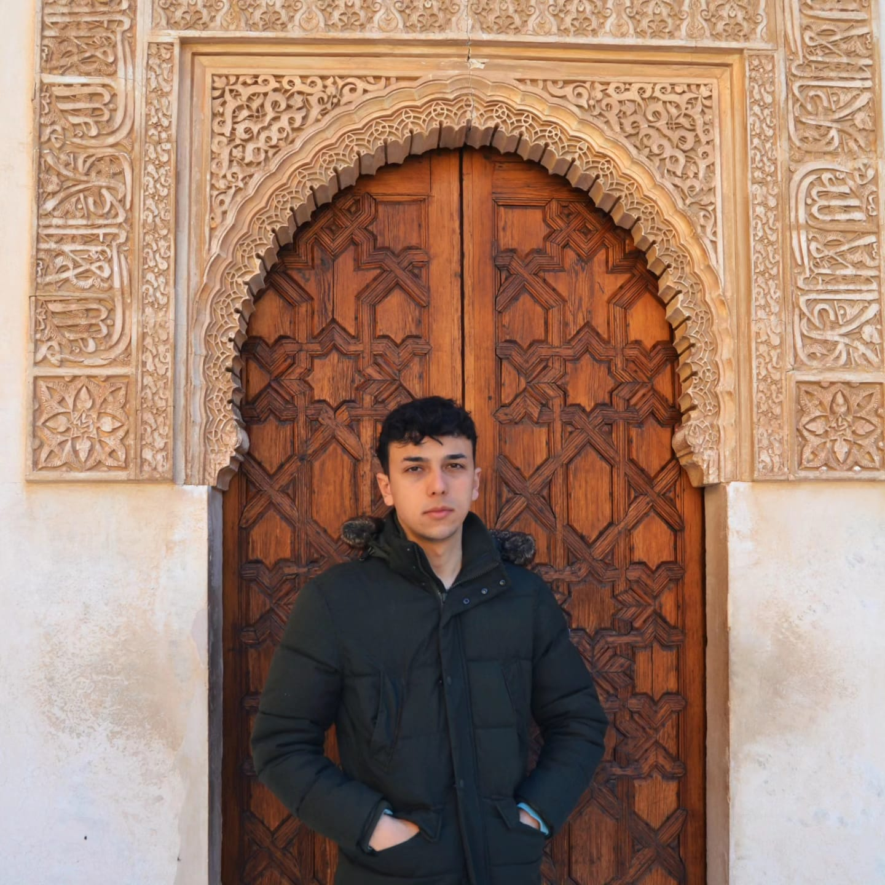

# Sobre mí

# Nombre
**Alejandro**

# Apellidos
**Fernandez Arrayás**

# Ciudad de origen
**Córdoba, Andalucía**

# Hobbies
- Jugar videojuegos
- Voleibol

# Redes Sociales & Correo Electronico
- **Correo electrónico:** a24fearal@iesgrancapitan.org
- **GitHub:** [AlejandroArrayas](https://github.com/AlejandroArrayas)

# Mi cita favorita
> "Voy buscando en otro planeta lo que no encuentro en esta tierra." - Arde Bogotá

# Mi foto

# Expectativas del módulo:
**Aprender:** Me gustaria obtener el suficiente conocimiento para poder desembolverme bien en el mundo laboral dentro de un futuro 
**Exploración de nuevas tecnologías:** Me gustaría conocer herramientas y tecnologías emergentes que complementen mis habilidades actuales.
